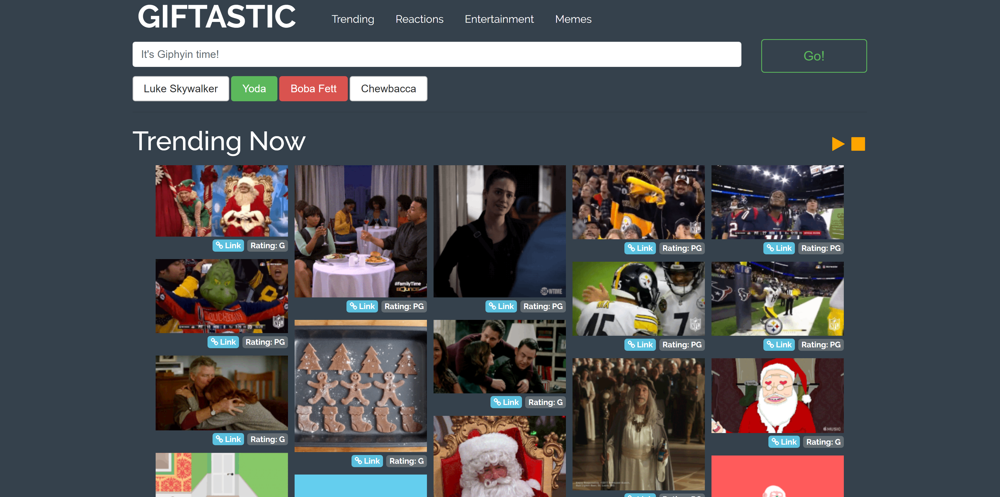

# GifTastic

Uses the GIPHY API to make a dynamic web page that populates with gifs of your choice

Link: https://saloiofun.github.io/GifTastic/

## Getting Started

* Type in the search bar to load gifs related to your keywords.

* Click on any gif to start the animation.

* Click on "Link" button to copy the URL.

## Tools used

* HTML 5
* CSS
* JavaScript
* Jquery
* GIPHY API
* [Clipboard.js](https://zenorocha.github.io/clipboard.js)
* [Masonry.js](https://masonry.desandro.com/)